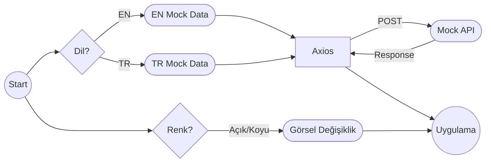

# Sprint Challenge: _Kişisel Web Sitesi_

## Proje Açıklaması

Tebrikler, Frontend konularını tamamladın. Backend konularına geçmeden, şimdiye kadar öğrendiğin her konuyu kullanarak, kişisel web sayfası yapacaksın. Yaptığın siteyi kendi profil sayfanda da yayınlayacaksın. Bu senin Frontend konusunda ne seviyede olduğunu gösterecek.

Workintech programını tamamladığında, görüştüğün şirketler yaptığın bu projeye de bakacaklar. O yüzden **öğrendiğin her konuyu kullanmaya çalışman önemli**. Projeni, tam çalışır durumda, gramer hatası olmayan bir proje yapmanı tavsiye ederiz.

S12 içinde de Workintech eğitmenlerine, adeta bir teknik mülakttaymış gibi, bu projeyi sunmanı istiyoruz. Bu sunumda, _4 dk_ içerisinde, CSS'e döktüğün arayüzü ve de geliştirdiğin Reach JS sistemi anlatacaksın. İlk önce arayüzde nasıl bir kullanıcı deneyimi sunduğunu kısaca özetleyip, sonra altta kodların nasıl çalıştığını, nasıl bir veri akışı kurduğunu, açık bir şekilde ifade edebilmelisin.

> Kısaca: 4 dk içinde, önce arayüzü anlatıp, sonra kodun nasıl
> çalıştığını ifade edebilmelisin. Zaman kullanımı ve sunum tekniğin de değerlendirme kriterlerinde yer alıyor. Öncesinde, kendini videoya çekerek, sunum pratiği yapabilirsin.

Not\* Bu dökümanın en sonunda da, sunumda seni değerlendireceğimiz başlıkları da bulabilirsin.

## Talimatlar

### Görev 1: Proje Kurulumu

- [ ] `npx create-react-app web-sayfam` komutuyla boş bir çalışma başlatabilirsin.
- [ ] Oluşturulan `web-sayfam` klasörüne gir.
- [ ] `npm` i kullanarak, gerekli gördüğün kütüphaneleri projene ekleyebilirsin. _Örneğin:_

- `axios`
- `yup`
- `toastify`
- `tailwind`
- `cypress.io` v.b.

### Görev 2: UI Tasarımı ve React JS Geliştirmeleri

[Bu bağlantıda](https://www.figma.com/file/YuAwEInBB8GqOO7wNosr5j/s12-design202304?node-id=0%3A1&t=U1HnfQaOkunlvpNb-1) 3 farklı tasarım var. Hangisini beğenirsen onu kullanabilirsin. CSS stillerini ve HTML/JSX iskeletini geliştirirken, tasarımı bire bir yaptığını **emin olana kadar** kesinlikle özelleştirmemeni tavsiye ediyoruz.

- [ ] Tasarımdaki her bir section için ayrı bir component oluşturun.
- [ ] Her component'in style'ını ayarlayın.
- [ ] Verilerinizi kendi oluşturduğunuz, mock (örnek) verileri statik bir js dosyasından çekin.
- [ ] `axios` ve reqres.in gibi bir servisle, web API simüle et.
- [ ] Dark Mode tasarımı da entegre edin.
- [ ] Türkçe-İngilizce içerik oluşturun.
- [ ] Responsive özelleştirmelerini yapın.

#### Önemli Notlar!

- Tasarımı birebir uygulamalısın.
  - Resimleri ve projeleri kendi projelerinle güncelleyebilirsin. Yine de kesinlikle **renkler ve yerleşimde** değişiklik istemiyoruz.
  - Sunumdan sonra dilersen sonrasında kendi portföyün için özelleştirebilirsin.
  - Mobil ve tablet gibi farklı cihaz boyutları için,
    tasarımda biraz değişiklik insiyatif kullanmak zorunda kalabilirsin
- Axios ile API request simple etmelisin.
  - [https://reqres.in/api/workintech](https://reqres.in/workintech) veya benzeri
    ücretsiz bir mock api servisine, `axios` ile POST ile kendi datanızı atıp, gelen mock datayı arayüze basabilirsin.

> Böylece backende geçince de yönetim paneli yazıp, hem kod kalitesi hem yapabildiğiniz her şeyi tek projede birleştirmiş olacaksınız.

### İstenilen Veri Diagramı

### Görev 3: Yayına Almak

Projenizi vercel'de yayınlayın.

> Öncesinde geliştirdiğiniz bütün projelerin de vercel'deki linklerini
> eklediğinize dikkat edin.

### Görev 4: İleri Düzey (ADV) Görevler

Frontend'de ne kadar yetenekli olduğunu, hünerlerini göstermek için ekstra yapabileceklerin.

- [ ] Site ilk açıldığında, kullanıcın görünüm tercihini okuyup, ona göre dil ve renk temasını aktifleştirebilirsin. Kullanıcı tercihini, tarayıcı belleğine (localstorage) kaydedebilirsin.
  - [ ] Dark Mode geliştirmesi,
  - [ ] Türkçe/İngilizce içerik ve dil seçimi.

| **Değerlendirme Kriteri**                                                                                      | **Puan** |
| -------------------------------------------------------------------------------------------------------------- | -------- |
| Projesini sunma becerisi                                                                                       |          |
| Kodun nasıl çalıştığını ifade edebilme becerisi                                                                |          |
| Süre kullanımı Max: 4 dk                                                                                       |          |
|                                                                                                                |          |
| **DESIGN, CSS**                                                                                                |          |
| Tasarımda tutarlı bir layout kullanılmış mı?                                                                   |          |
| CSS selector kullanımı kalitesi?                                                                               |          |
| CSS flex becerisi ortalama ve hizalamalar doğru mu?                                                            |          |
| HTML yapısı anlamlı mı? Semantik tagler kullanılmış mı?                                                        |          |
| Figmadaki tasarıma benzerlik (1-5)                                                                             |          |
| Responsive davranış                                                                                            | ADV      |
| Responsive uyarlama kabiliyeti (1-5)                                                                           | ADV      |
| Gece Modu eklenmiş mi? Form vs                                                                                 | ADV      |
| Gece Modu'nun ana tasarımla uyumu (1-5)                                                                        | ADV      |
|                                                                                                                |          |
| React JS                                                                                                       |          |
| İçerik componentlere bölünmüş mü?                                                                              |          |
| Prop/export/import gibi React JS özellikleri kullanılmış mı?                                                   |          |
| Temel paketler dışında ek bir paket kullanılmış mı? Toastify/Tailwind                                          | ADV      |
| Kodda Türkçe karakter olmamasına dikkat edilmiş mi?                                                            |          |
| Genel React JS anlayışı (1-5)                                                                                  |          |
|                                                                                                                |          |
| Veri Yönetimi                                                                                                  |          |
| Veriler state'te tutuluyor mu?                                                                                 |          |
| Verileri bir js dosyasından, dinamik eklemiş mi?                                                               | ADV      |
| Tekrar eden bileşenler için map kullanmış mı?                                                                  |          |
| Kullandığı verileri, axios ve mock bir API'ye atıp, response'u kullanıyor mu?                                  | ADV      |
|                                                                                                                |          |
| Gece Modu                                                                                                      | ADV      |
| Gece Modu tasarımı eklenmiş mi?                                                                                | ADV      |
| Sistem tercihi dark mode ise (sistem ayarlarında), sayfa ilk seferinde dark açılmalı (prefers-color-scheme).   | ADV      |
| Tarayıcı dili TR değilse, sayfa ilk seferinde EN, TR ise TR içerik ile açılmalı (navigator.languages).         | ADV      |
| Renk modu değiştikçe, tarayıcı ön belleğine (localstorage) kaydediliyor ve sayfa yenilendiğinde okunuyor mu?   | ADV      |
| Dil Değiştirme                                                                                                 | ADV      |
| Dil değişimi kodlara eklenmiş mi?                                                                              | ADV      |
| Dil tercihi değiştikçe, tarayıcı ön belleğine (localstorage) kaydediliyor ve sayfa yenilendiğinde okunuyor mu? | ADV      |
|                                                                                                                |          |
| Vercel                                                                                                         |          |
| Bu proje sunumdan önce vercele yüklenmiş mi?                                                                   |          |
| Önceki projeleri vercele yüklenmiş mi?                                                                         |          |
|                                                                                                                |          |
| Soru-Cevap Sorular                                                                                             |          |
| useState'ten Redux Store'a ne zaman geçmek gerekir?                                                            |          |
| useContext ile state/store farklı mıdır?                                                                       |          |
| Açık Uçlu Sorular                                                                                              |          |
