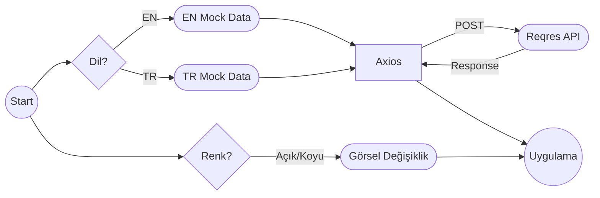

# Sprint Challenge: _Kişisel Web Sitesi_

## Proje Açıklaması

Tebrikler, Frontend konularını tamamladın. Backend konularına geçmeden, şimdiye kadar öğrendiğin her konuyu kullanarak, kişisel web sayfası yapacaksın. Yaptığın siteyi kendi profil sayfanda da yayınlayacaksın. Bu senin Frontend konusunda ne seviyede olduğunu gösterecek.

Workintech programını tamamladığında, görüştüğün şirketler yaptığın bu projeye de bakacaklar. O yüzden **öğrendiğin her konuyu kullanmaya çalışman önemli**. Projeni, tam çalışır durumda, gramer hatası olmayan bir proje yapmanı tavsiye ederiz.

S12 içinde de Workintech eğitmenlerine, adeta bir teknik mülakttaymış gibi, bu projeyi sunmanı istiyoruz. Bu sunumda, _4 dk_ içerisinde, CSS'e döktüğün arayüzü ve de geliştirdiğin Reach JS sistemi anlatacaksın. İlk önce arayüzde nasıl bir kullanıcı deneyimi sunduğunu kısaca özetleyip, sonra altta kodların nasıl çalıştığını, nasıl bir veri akışı kurduğunu, açık bir şekilde ifade edebilmelisin.

> Kısaca: 4 dk içinde, önce arayüzü anlatıp, sonra kodun nasıl
> çalıştığını ifade edebilmelisin. Zaman kullanımı ve sunum tekniğin de değerlendirme kriterlerinde yer alıyor. Öncesinde, kendini videoya çekerek, sunum pratiği yapabilirsin.

Not\* Bu dökümanın en sonunda da, sunumda seni değerlendireceğimiz başlıkları da bulabilirsin.

## Talimatlar

### Görev 1: Proje Kurulumu

- [ ] `npm create vite@latest` komutuyla boş bir çalışma başlatabilirsin. [Dökümantasyon: Scaffolding Your First Vite Project](https://vitejs.dev/guide/#scaffolding-your-first-vite-project)
- [ ] Oluşturulan proje klasörüne gir.
- [ ] `npm` i kullanarak, gerekli gördüğün kütüphaneleri projene ekleyebilirsin. _Örneğin:_
- `axios`
- `toastify`
- `tailwind`
- `cypress.io` v.b.

### Görev 2: UI Tasarımı ve React JS Geliştirmeleri

[Bu bağlantıda](https://www.figma.com/file/YuAwEInBB8GqOO7wNosr5j/s12-design202304?node-id=0%3A1&t=U1HnfQaOkunlvpNb-1) 3 farklı tasarım var. Hangisini beğenirsen onu kullanabilirsin. CSS stillerini ve HTML/JSX iskeletini geliştirirken, tasarımı bire bir yaptığını **emin olana kadar** kesinlikle özelleştirmemeni tavsiye ediyoruz.

- [ ] Tasarımdaki her bir section için ayrı bir component oluşturun.
- [ ] Her component'in style'ını ayarlayın.
- [ ] Verilerinizi kendi oluşturduğunuz verileri statik bir json dosyasından çekin.
- [ ] Dark Mode tasarımı da entegre edin.
- [ ] Türkçe-İngilizce içerik oluşturun.
- [ ] Responsive özelleştirmelerini yapın. Mobil ve tablet gibi farklı cihaz boyutları için, tasarımda biraz değişiklik yapabilirsin. Buralarda insiyatif kullanabilirsin.

#### Önemli Notlar!

- Dil yönetiminde i18n gibi bir paket kullanmanızı ASLA istemiyoruz. useContext veya Redux kullanarak, veri yönetimi, ve görüntüleme katmanının izole olduğu bir proje yapabildiğinizi görmek istiyoruz.
-  Tasarımı birebir uygulamalısın.
  - Resimleri ve projeleri kendi projelerinle güncelleyebilirsin. Yine de kesinlikle **renkler ve yerleşimde** değişiklik istemiyoruz.
  - Sunumdan sonra dilersen sonrasında kendi portföyün için özelleştirebilirsin.
- Axios ile *https://reqres.in/api/workintech* (yereldeki data.js, POST) veya başka bir sahte API servisi ile dış kaynakla iletişim kurabildiğini gösterebilmelisin. Dış servis ile iletişim kurmayı projenin en sonuna atın. Önceliği en düşük kısımlardan biri bu. Daha detaylı dış servis kurmayı ileride öğreneceksiniz.

https://mockapi.io veya benzeri bir servisle, projeniz bitmeden önce zaman kaybedip, asıl yapmanız gerekenleri öncelik sırasına göre yapmayıp, talimat dışına çıkarsanız düşük not alabilirsiniz. Data için reqres.in dışında bir servis kullanmaya zaman harcayanlar genelde yetiştiremiyor. Sunumdan sonra ayrıca isterseniz bakabilirsiniz. 

> Böylece backende geçince de yönetim paneli yazıp, hem kod kalitesi hem yapabildiğiniz her şeyi tek projede birleştirmiş olacaksınız.

### Temsili Veri Akış Diagramı

### Görev 3: Yayına Almak

Projenizi vercel.com veya render.com yayınlayın.

> Öncesinde geliştirdiğiniz bütün projelerin de vercel'deki linklerini
> eklediğinize dikkat edin.

# Değerlendirme Kriterleri

## 1. Projesini zamanlamaya da dikkat ederek mülakattaymış gibi anlatabilir.(%4)

### 1 - Beklentilerin Altında

- **Demo ve Kod Sunumu Zamanlaması:** Aday, belirlenen zaman sınırlarına uymakta zorlanıyor. Demo veya kod sunumu için ayrılan süreleri aşırı derecede aşıyor ya da yeterince kullanmıyor.
- **Demo İçeriği:** Demo, projenin çalışır durumunu etkili bir şekilde göstermiyor. Aday, ana özellikleri ve işlevselliği açıkça sunamıyor veya demo sırasında teknik sorunlarla karşılaşıyor.
- **Kod Sunumu:** Aday, kodun önemli bölümlerini açıklamakta zorlanıyor veya kodun nasıl çalıştığına dair net bilgiler veremiyor. Temel algoritma ve tasarım kararlarını açıklayamıyor veya yanlış bilgi veriyor.

### 2 - Gereklilikleri Karşılar

- **Demo ve Kod Sunumu Zamanlaması:** Aday, belirlenen süreler içerisinde demo ve kod sunumunu gerçekleştiriyor. Zaman yönetimi iyi; ne çok acele ediyor ne de zamanı boşa harcıyor.
- **Demo İçeriği:** Demo, projenin ana özelliklerini ve işlevselliğini başarılı bir şekilde gösteriyor. Aday, projenin çalışır durumunu ve kullanıcı etkileşimlerini etkili bir şekilde sunuyor.
- **Kod Sunumu:** Aday, kodun önemli bölümlerini ve nasıl çalıştığını açıklayabiliyor. Temel algoritma ve tasarım kararlarını mantıklı bir şekilde sunuyor ve soruları tatmin edici şekilde yanıtlıyor.

### 3 - Gerekliliklerin Üzerinde

- **Demo ve Kod Sunumu Zamanlaması:** Aday, zamanı mükemmel bir şekilde yönetiyor. Önceden pratik yapılmış. Demo ve kod sunumu için ayrılan süreyi tam olarak kullanıyor, her şeyi net ve öz bir şekilde anlatıyor.
- **Demo İçeriği:** Demo, projenin işlevselliğini, kullanıcı deneyimini ve ana özelliklerini detaylı ve etkileyici bir şekilde gösteriyor. Aday, kullanıcı etkileşimleri ve projenin nasıl çalıştığını anlamak için önemli ayrıntıları sunuyor, gereksizlerle zaman kaybetmiyor.
- **Kod Sunumu:** Aday, kodun kritik bölümlerini derinlemesine ve açık bir şekilde açıklıyor. İleri seviye programlama teknikleri, tasarım desenleri ve optimizasyon stratejileri hakkında bilgi veriyor. Sorulara kapsamlı ve bilgilendirici yanıtlar sağlıyor.

## 2. Görseldeki bir tasarımı anlamlı bir HTML yapısı ve doğru semantik tagler kullanarak, hizalamalara ve CSS özelliklerine dikkat ederek koda dökebilir. (%12)

### **1 - Beklentilerin Altında**

- **HTML Yapısı:** Temel HTML etiketleri kullanılıyor ancak semantik taglerden (örneğin, `<article>`, `<nav>`, `<section>` gibi) yeterince veya hiç faydalanılmıyor. HTML yapısı düzensiz veya anlamsız; belirli içerik bölümleri açıkça ayrılmamış.
- **CSS ve Hizalama:** CSS kullanımı çok basit veya hatalı. Tasarımı yansıtan detaylara (margin, padding, font boyutları, renkler gibi) dikkat edilmemiş veya yanlış uygulanmış. Hizalama, tasarımda belirtilen düzene uymuyor.

### **2 - Gereklilikleri Karşılar**

- **HTML Yapısı:** Anlamlı ve mantıklı bir HTML yapısı kullanılmış. Semantik tagler doğru yerlerde ve uygun şekilde kullanılmış. İçerik, semantik anlamına göre uygun şekilde bölümlere ayrılmış.
- **CSS ve Hizalama:** CSS özellikleri tasarımı yansıtacak şekilde doğru kullanılmış. Renkler, fontlar, boşluklar (margin ve padding) ve diğer tasarım özellikleri tasarıma uygun şekilde uygulanmış. Hizalama tasarımdaki gibi düzgün.

### **3 - Gerekliliklerin Üzerinde**

- **HTML Yapısı:** HTML yapısı, semantik anlamda mükemmel bir düzeyde. Yapı, aksesuarlığa ve SEO'ya katkıda bulunacak şekilde optimize edilmiş. ARIA rol ve özellikleri gibi ek HTML5 özellikleri kullanılarak erişilebilirlik üzerinde durulmuş.
- **CSS ve Hizalama:** CSS3 ve ileri düzey tasarım teknikleri (flexbox, grid sistemleri gibi) etkili bir şekilde kullanılarak, hizalama ve tasarım detayları mükemmel bir şekilde uygulanmış. Görsel efektler ve animasyonlar eklenmiş, kullanıcı deneyimini artıracak şekilde detaylara dikkat edilmiş.

## 3. Yaptığı sayfayı responsive hale getirebilir, karanlık tema ekleyebilir.(%15)

### 1 - Beklentilerin Altında

- **Responsive Tasarım Uygulaması:** Sayfa, farklı ekran boyutlarında düzgün bir şekilde görüntülenemiyor. Medya sorguları (media queries) kullanılmamış veya yanlış kullanılmış. Sayfanın layout'u büyük veya küçük ekranlarda bozuluyor.
- **Esneklik:** Sayfanın içerikleri (resimler, metinler, diğer elementler) ekran boyutuna göre uyum sağlamıyor veya elementler kesiliyor/üst üste biniyor.
- **Kullanıcı Deneyimi:** Kullanıcı deneyimi göz ardı edilmiş, mobil veya tablet gibi cihazlarda gezinmek ve içeriği okumak zor.
- **Karanlık Tema:** Aday karanlık tema özelliğini entegre etmemiş veya çok yetersiz bir yaklaşım kullanmış, bu da kullanıcı deneyimini ve temasal tutarlılığı olumsuz etkilemiş. Örneğin, sadece arka plan rengini değiştirmek gibi, ancak diğer öğeler (metin renkleri, kenarlık renkleri vb.) için gerekli ayarlamalar yapılmamış olabilir

### 2 - Gereklilikleri Karşılar

- **Responsive Tasarım Uygulaması:** Sayfa, çoğu cihaz ve ekran boyutunda düzgün görüntüleniyor. Medya sorguları etkili bir şekilde kullanılmış ve sayfanın layout'u farklı ekran boyutlarına göre uygun şekilde ayarlanmış.
- **Esneklik:** İçerikler (resimler, metinler, diğer elementler) farklı ekran boyutlarına esnek bir şekilde uyum sağlıyor. Görseller ve metinler okunabilir ve net.
- **Kullanıcı Deneyimi:** Kullanıcı deneyimi farklı cihazlarda iyi düzeyde. Sayfa üzerinde gezinmek ve içeriği tüketmek kolay.
- **Karanlık Tema:** Aday, sayfaya karanlık tema özelliği eklemiş ve bu tema üzerinde temel düzeyde bir tutarlılık sağlamış. Arka plan, metin ve UI öğelerinin renkleri karanlık modda uyumlu hale getirilmiş. Tailwind gibi bir kütüphane kullandıysa, oradaki metodları ufak yanlışlarla da olsa uyarlamış. İnce detaylar ve kullanıcı tercihine bağlı tema değişikliği gibi ileri düzey özellikler eksik olabilir.

### 3 - Gerekliliklerin Üzerinde

- **Responsive Tasarım Uygulaması:** Sayfa, tüm cihaz ve ekran boyutlarında mükemmel bir şekilde görüntüleniyor. İleri düzey medya sorguları ve CSS/HTML teknikleri kullanılarak responsive tasarımın her yönü dikkate alınmış.
- **Esneklik ve Optimizasyon:** İçerikler mükemmel bir şekilde esnek; resimler ve metinler her ekran boyutunda ideal görüntüleniyor. Sayfa yükleme süreleri optimize edilmiş ve performans açısından üst düzeyde.
- **Kullanıcı Deneyimi ve Erişilebilirlik:** Üstün kullanıcı deneyimi, navigasyon kolaylığı ve içerik erişilebilirliği sağlanmış. Erişilebilirlik özellikleri (klavye gezinmesi, ekran okuyucu dostu yapılar vb.) entegre edilmiş, böylece çeşitli kullanıcıların ihtiyaçlarına cevap verilmiş.
- **Karanlık Tema:** Temayı hem görsel hem mimari olarak mükemmel bir şekilde entegre edilmiştir. Bu, CSS değişkenleri veya CSS media query prefers-color-scheme gibi modern yöntemler kullanılarak gerçekleştirilmiş olabilir. Kullanıcı tercihine bağlı olarak tema değiştirilebilir, ve karanlık tema, UI öğelerinin, metinlerin, kenarlıkların ve diğer tasarım öğelerinin renklerini kapsayacak şekilde kapsamlı bir şekilde uygulanmış. Tailwind kullanmış olsun ya da olmasın, kod tekrarını azaltabilecek.

## 4. Kodu componentlere bölebilir, bu componentları map metodu ile kullanabilir.(%7)

### 1 - Beklentilerin Altında

- **Bileşenlere Bölme:** Kod, yeterince veya hiç bileşene ayrılmamış. Bileşenler arası sorumlulukların ve işlevlerin ayrımı zayıf, bu da tekrar kullanılabilirliği ve okunabilirliği düşürür.
- **`**map**`\*\*** Kullanımı:\*\* `map` metodu yanlış kullanılıyor veya hiç kullanılmıyor. Veri listeleri veya tekrar eden bileşenler üzerinde iterasyon yapılmamış. Elle girilmiş.
- **Veri Yönetimi:** Veriler, bileşenler arasında etkili bir şekilde aktarılmıyor. Props ve state yönetimi anlaşılır ve etkili bir şekilde kullanılmamış.

### 2 - Gereklilikleri Karşılar

- **Bileşenlere Bölme:** Kod, mantıklı bileşenlere uygun şekilde ayrılmış. Bileşenler, belirli işlevsellikleri veya UI bölümlerini kapsar şekilde organize edilmiş, bu da kodun yeniden kullanılabilirliğini ve bakımını kolaylaştırır.
- **`**map**`\*\*** Kullanımı:\*\* `map` metodu, listeler üzerinde ve bileşenler üzerinde iterasyon yapmak ve bu verileri bileşenler aracılığıyla render etmek için doğru kullanılmış. Bileşenlerin dinamik listelerini oluşturmak için etkili bir şekilde kullanılır.
- **Veri Yönetimi:** Veri akışı ve bileşenler arası veri iletimi, props ve state kullanılarak uygun şekilde yönetilmiş. Bileşen hiyerarşisi içinde verilerin akışı anlaşılır ve mantıklı.

### 3 - Gerekliliklerin Üzerinde

- **Bileşenlere Bölme:** Kod, yüksek derecede sayfalara ve yeniden kullanılabilir bileşenlere mükemmel şekilde ayrılmış. Bileşenler arası sorumluluk ve işlevsellik ayrımı, uygulamanın genel mimarisini güçlendirir ve genişletilebilirliği artırır.
- **`**map**`\*\*** Kullanımı:\*\* `map` metodu, veri listelerini efektif şekilde işleyerek bileşenleri render etmede ileri düzeyde kullanılmış. Karmaşık veri yapıları üzerinde bile dinamik bileşen listeleri oluşturulabilir ve bu süreçte anahtar (key) kavramı gibi ileri düzey konseptler etkili bir şekilde entegre edilmiş.
- **Veri Yönetimi ve Performans Optimizasyonu:** Veri akışı, bileşenler arası iletişim ve state yönetimi, uygulamanın performansını ve kullanıcı deneyimini iyileştirecek şekilde optimize edilmiş. Context API, Redux veya benzeri durum yönetim kütüphaneleri kullanılarak global state yönetimi, best practiceleri ile entegre edilmiş ve veri akışı daha da etkili bir şekilde yönetilmiş.

## 5. State, props ve veri akışı gibi React'ın temel çalışma prensiplerini anlayabilir ve kullanabilir.(%8)

### 1 - Beklentilerin Altında

- **State Yönetimi:** State (durum) kavramını ve önemini tam olarak anlamamış. State'i props ile karıştırıyor veya state kullanımında temel hatalar yapıyor. Komponentin yeniden render edilmesi gerektiğinde state'i doğru şekilde güncelleyemiyor.
- **Props Kullanımı:** Props'un ne olduğunu ve nasıl kullanılacağını temel düzeyde biliyor olabilir, ancak props'ları komponentler arası veri iletiminde etkili bir şekilde kullanamıyor. Parent-child komponent ilişkisinde veri aktarımının nasıl çalıştığını tam olarak kavrayamamış.
- **Veri Akışı:** Tek yönlü veri akışını (top-down) anlamakta ve uygulamakta güçlük çekiyor. Veri akışını yönetmek için gerekli React özellikleri ve yöntemleri hakkında yetersiz bilgi sahibi.

### 2 - Gereklilikleri Karşılar

- **State Yönetimi:** State'in ne olduğunu ve bir komponentin iç durumunu nasıl yöneteceğini iyi bir şekilde anlıyor. `setState` kullanımında rahat ve state'in komponentin yeniden render edilmesini nasıl tetiklediğini biliyor.
- **Props Kullanımı:** Props'ları komponentler arası veri aktarımında etkili bir şekilde kullanabiliyor. Parent komponentlerden child komponentlere veri geçişinin nasıl yapıldığını ve props'ların komponentlerin yeniden kullanılabilirliğini nasıl artırdığını anlıyor.
- **Veri Akışı:** React'taki tek yönlü veri akışını (parent'tan child'a) anlıyor ve bunu uygulamalarında doğru şekilde kullanabiliyor. Context API veya Redux gibi global state yönetimi araçlarını temel düzeyde kullanabiliyor olabilir.

### 3 - Gerekliliklerin Üzerinde

- **State Yönetimi:** Komponentler arası state yönetiminde ustalaşmış, `useState`, `useReducer` gibi Hook'ları etkili bir şekilde kullanabiliyor. State'in immutability'sini (değişmezliğini) koruma ve komponent performansını optimize etme konusunda bilgili.
- **Props Kullanımı:** Props'ları sadece veri aktarımında değil, komponentler arası işlevsellik paylaşımında da ustaca kullanıyor. Higher-order components (HOC'lar), render props ve diğer ileri düzey React örüntüleri konusunda deneyimli.
- **Veri Akışı:** Context API, Redux, React Query gibi state yönetim kütüphanelerini, kullanırken etkin bir şekilde kullanarak uygulama genelinde veri akışını yönetebiliyor. Stateful Hooklar yazarak, state yönetimi, asenkron veri yönetimini HOC'ler ile iyileştirebilmiş. Uygulamanın durumunu merkezi bir yerden yönetme ve iş mantığını bileşenlere paylaştırma konusunda ileri düzeyde deneyime sahip.

## 6. Uzak bir veri kaynağından (API) axios yardımıyla veri alabilir ve bu veriyi kullanabilir.(%7)

### 1 - Beklentilerin Altında

- **API İstekleri:** Axios kullanımı temel düzeyde veya hiç eklenmemiş. Statik veri ile ilerlenmiş. Hata yakalama ve istek yönetimi eksik veya yanlış uygulanmış.
- **Mimarisi:** Alınan veriler doğrudan ve işlenmeden kullanılamaz halde. Bileşenlerin içerisine statik olarak yazılmış. Verilerin kullanıcı arayüzünde (UI) gösterimi sınırlı veya eksik.

### 2 - Gereklilikleri Karşılar

- **API İstekleri:** Axios kullanılarak RESTful API'den veri başarıyla alınabilir. GET, POST gibi farklı HTTP metodları kullanılarak veri alışverişi yapılabilir. Axios'un temel özellikleri uygun şekilde kullanılmış.
- **Veri Kullanımı:** Reqres'e atılan veriler, uygun şekilde işlenebilir. Veri, kullanıcıya net ve anlaşılır bir formatla sunulur. Dil değişimi gibi kullanıcı etkileşimine dayalı, verileri Axios ile yeniden alabilir.
- **Hata Yönetimi ve Geri Bildirim:** API isteklerinde hata yönetimi console.error seviyesinde de olsa, bir şekilde uygulanmış. Kullanıcıya yükleme durumları, hatalar veya başarılı işlem geri bildirimlerinden en az biri açık ve anlaşılır bir şekilde sunulur.

### 3 - Gerekliliklerin Üzerinde

- **API İstekleri:** Axios ile merkezi bir instance oluşturulmuş gelişmiş API istekleri yapılabiliyor; Hooklar gibi ileri düzey özellikler kullanılarak ilgili iş zekası bileşenlerden soyutlanmıştır.
- **Veri Kullanımı:** Alınan veri, Higher Order Components (HOC) mimarisiyle, işlenebilir kod tekrarı ve prop dilling olmadan, veriler üzerinde kompleks dönüşümler (örneğin, gruplama, toplama) yapılır ve kullanıcı arayüzünde (UI) zengin görsel bileşenlerle gösterilir.
- **Hata Yönetimi ve Geri Bildirim:** Kapsamlı hata yönetimi ve kullanıcıya yönelik detaylı geri bildirim mekanizmaları uygulanmış. Veri daha önce yüklendiyse, yeniden istek atılmaması için performans iyileştirmeleri yapılmış ve kullanıcı deneyimini optimize eden özellikler (örneğin, veri yükleme sırasında görsel geri bildirimler, lazy loading) entegre edilmiş.

## 7. Yazılımcı ve/veya kullanıcı deneyimini iyileştirmek için Tailwindcss, react-toastify gibi ek kütüphaneler ekleyebilir ve kullanabilir.%(10)

### 1 - Beklentilerin Altında

- **Kütüphane Entegrasyonu:** Kütüphaneler projeye hatalı veya eksik şekilde entegre edilmiş. Bu, uygulamada beklenen özelliklerin doğru çalışmamasına veya hatalara yol açabilir.
- **Kullanım ve Uygulama:** Kütüphanelerin özellikleri ve bileşenleri yanlış kullanılmış veya etkisiz bir şekilde uygulanmış. Örneğin, TailwindCSS ile yapılan stillemeler düzensiz veya tutarsız; React-Toastify için bildirimler doğru şekilde konumlandırılmamış veya stilize edilmemiş.
- **Performans ve Uyumluluk:** Eklenen kütü er uygulamanın performansını olumsuz etkileyebilir veya diğer kütüphaneler/kod parçalarıyla uyumsuzluklar gösterebilir.

### 2 - Gereklilikleri Karşılar

- **Kütüphane Entegrasyonu:** Gerekli kütüphaneler doğru ve başarılı bir şekilde projeye eklenmiş. Kütüphane dokümantasyonları takip edilerek entegrasyon yapılmış.
- **Kullanım ve Uygulama:** Kütüphanelerin sağladığı bileşenler ve özellikler, uygulamada beklenen işlevleri gerçekleştirecek şekilde doğru kullanılmış. TailwindCSS ile tutarlı ve duyarlı bir şekilde stil verilmiş; React-Toastify ile kullanıcıya geri bildirimler uygun şekilde sunulmuş.
- **Performans ve Uyumluluk:** Eklenen kütüphaneler, uygulamanın genel performansını büyük ölçüde etkilemez ve diğer kütüphanelerle veya uygulama koduyla uyum içinde çalışır.

### 3 - Gerekliliklerin Üzerinde

- **Kütüphane Entegrasyonu:** Kütüphaneler, projeye sadece başarılı bir şekilde entegre edilmekle kalmamış, aynı zamanda gelişmiş özellikleri ve yapılandırmaları kullanarak maksimum potansiyelleri ortaya çıkarılmış. Örneğin, TailwindCSS'in özelleştirme özellikleri kullanılarak markaya özel tema oluşturulmuş ve config içerisinde ana renkler tanımlanıp kullanılmış. React-Toastify ile promise cycle içerisinde, sunucudan yanıt gelene kadar yükleniyor mesajıyla zengin içerikli ve özelleştirilmiş bildirimler yapılmış.
- **Kullanım ve Uygulama:** Kütüphanelerin ileri düzey özellikleri etkili bir şekilde kullanılmış ve uygulama özelinde özelleştirilmiş. Bu, kullanıcı deneyimini zenginleştiren ve uygulamanın işlevselliğini genişleten özellikler eklenmesini sağlamış. Örneğin kullanılan animas
- **Performans ve Uyumluluk:** Kütüphaneler, performans optimizasyonları gözetilerek entegre edilmiş. Uygulamanın yüklenme süresi ve çalışma zamanı performansı üzerinde dökümantasyondaki iyi uygulamalar incelenerek, yönergeler dışına çıkmadan, özellikler ve stillemeler etkili bir şekilde kullanılmış.

## 8. LocalStorage kullanarak site dili, renk teması gibi tercihleri saklayabilir ve kullanabilir. (%8)

### 1 - Beklentilerin Altında

- **LocalStorage Kullanımı:** LocalStorage, sadece basit veri saklamak için kullanılır ve uygulamada bu verileri kullanma konusunda yeterli bir entegrasyon sağlanmamıştır. Kullanıcı tercihleri tutarlı bir şekilde saklanmaz veya saklanan veriler uygulama içinde doğru bir şekilde kullanılmaz.
- **Tercihlerin Uygulanması:** Saklanan tercihler (dil, renk teması vb.) uygulamanın farklı bölümlerinde tutarlı bir şekilde uygulanmamış veya hiç uygulanmamıştır. Kullanıcı arayüzü, saklanan tercihlere göre dinamik olarak güncellenmez.
- **Kullanıcı Deneyimi:** Kullanıcı tercihlerinin saklanması ve uygulanması, kullanıcı deneyimini iyileştirme açısından etkili olmamıştır. Kullanıcılar, tercihlerini her ziyaretlerinde yeniden ayarlamak zorunda kalabilir.

### 2 - Gereklilikleri Karşılar

- **LocalStorage Kullanımı:** LocalStorage etkili bir şekilde kullanılarak kullanıcı tercihleri (site dili, renk teması vb.) saklanır. Uygulama başlatıldığında, LocalStorage'dan bu tercihler okunur ve uygulama genelinde kullanılır.
- **Tercihlerin Uygulanması:** Saklanan kullanıcı tercihleri, uygulamanın uygun bölümlerinde tutarlı ve doğru bir şekilde uygulanır. Kullanıcıların ayarladığı dil ve renk teması gibi tercihler, uygulama yeniden yüklendiğinde veya başlatıldığında korunur.
- **Kullanıcı Deneyimi:** Kullanıcı tercihlerinin saklanması ve uygulamaya entegrasyonu, kullanıcı deneyimini olumlu yönde etkiler. Kullanıcılar, tercihlerinin hatırlanması sayesinde daha kişiselleştirilmiş bir deneyim yaşar.

### 3 - Gerekliliklerin Üzerinde

- **LocalStorage ve Custom Hook Kullanımı:** Aday, LocalStorage kullanımını özelleştirilmiş bir React hook'u ile entegre eder. Bu hook, tercihlerin saklanması, okunması ve güncellenmesi işlemlerini kolaylaştırır ve uygulama içinde tercihlerin yönetilmesini merkezi bir noktadan sağlar.
- **Tercihlerin Uygulanması ve Dinamik Güncellenmesi:** Kullanıcı tercihleri, uygulama içinde dinamik olarak güncellenir. Kullanıcılar tercihlerini değiştirdiğinde, bu değişiklikler anında uygulanır ve LocalStorage'a kaydedilir. Bu, örneğin, renk temasını veya dili anlık olarak değiştirme yeteneği gibi ileri düzey bir kullanıcı deneyimi sunar.
- **Performans ve Kullanıcı Deneyimi:** Özelleştirilmiş hook, performansı göz önünde bulundurarak tasarlanmıştır ve uygulamanın yüklenme süresi üzerinde minimal etkiye sahiptir. LocalStorage kullanılırken ilgili değişken stringe dönüştürülüp geri alınır.

## 9. Uygulama verilerini contextApi, Redux veya benzeri bir Global Store kullanarak yönetebilir.(%25)

### 1 - Beklentilerin Altında

- **Global Store Kullanımı:** Redux veya Context API kullanılmamış veya çok sınırlı ve yanlış bir şekilde kullanılmış. Örneğin, global store var ancak uygulamanın önemli verileri lokal component state'lerinde tutuluyor.
- **Dil Seçimi ve Tema Değişikliği:** Dil seçimi ve tema (dark mode) değişikliği gibi özellikler global store üzerinden yönetilmiyor. Bu tür kullanıcı tercihleri, her bir component içerisinde ayrı ayrı yönetiliyor veya tamamen statik bir şekilde uygulanmış.
- **Mantık Hataları:** Store'un güncellenmesi veya okunması sırasında mantık hataları yapılmış. Bu, uygulamanın beklenen davranışını bozuyor ve kullanıcı deneyimini olumsuz etkiliyor.

### 2 - Gereklilikleri Karşılar

- **Global Store Kullanımı:** Redux veya Context API, uygulama genelindeki verileri yönetmek için etkili bir şekilde kullanılmış. Ancak, bazı durumlarda veri akışı optimizasyonları veya daha ileri düzey kullanım eksik olabilir.
- **Dil Seçimi ve Tema Değişikliği:** Kullanıcı dil seçimi ve tema değişiklikleri global store üzerinden yönetiliyor, ancak bu tercihlerin uygulama genelinde tutarlı bir şekilde uygulanmasında küçük eksiklikler olabilir.
- **Veri Akışı ve Yönetimi:** Global store veri akışı mantıklı ve düzgün bir şekilde yapılandırılmış ancak performans ve tekrar kullanılabilirlik açısından iyileştirmelere ihtiyaç duyulabilir.

### 3 - Gerekliliklerin Üzerinde

- **Global Store Kullanımı:** Redux veya Context API, uygulamanın global state yönetimi için mükemmel bir şekilde kullanılmış. Veri akışı, uygulama genelinde tutarlı ve optimize edilmiş.
- **Dil Seçimi ve Tema Değişikliği:** Kullanıcı tercihleri (dil seçimi, tema değişikliği gibi) global store üzerinden etkili bir şekilde, ek hooklar üzerinden yönetiliyor ve bu tercihler uygulama genelinde anında yansıtılıyor. Ayrıca, bu tercihlerin kolaylıkla genişletilebilir ve bakımının yapılabilir olması sağlanmış.
- **Veri Akışı, Performans ve Erişilebilirlik:** Redux veya Context API ile veri akışı, uygulamanın performansını ve erişilebilirliğini artıracak şekilde optimize edilmiş. Lazy loading, code splitting gibi tekniklerle yüklemeler hızlandırılmış ve uygulamanın genel performansı iyileştirilmiş.

## 10. Yaptığı projeleri vercel.com, render.com gibi bir servis kullanarak yayınlayabilir.(%4)

### 1 - Beklentilerin Altında

- **Proje Yayınlama:** Aday, projeyi herhangi bir serviste yayınlamak için gerekli adımları tam olarak anlamamış veya takip edememiş. Vercel, Render.com gibi servisleri kullanma konusunda belirgin bir bilgi eksikliği veya yanlış uygulamalar gösteriyor.
- **Yayınlanmış Proje Sayısı:** 0 veya 1.
- **Hata Yönetimi:** Yayınlama sırasında karşılaşılan hataları çözmede zorlanıyor, hata mesajlarını anlamada veya sorunları gidermede yetersiz kalıyor.
- **Dökümantasyon ve Konfigürasyon:** Proje konfigürasyonu ve dökümantasyonu eksik veya kendi projesiyle, servislerin sağladığı özellikleri ve konfigürasyonları karşılaştırıp, doğru bir şekilde uygulayamıyor.

### 2 - Gereklilikleri Karşılar

- **Proje Yayınlama:** Aday, projelerini Vercel, Render.com gibi popüler servisler kullanarak başarıyla yayınlayabilir. Temel konfigürasyonları yapabilir ve yayınlama sürecini sorunsuz bir şekilde tamamlayabilir.
- **Yayınlanmış Proje Adeti:** 2 proje + bir portfolyo projesi.
- **Hata Yönetimi:** Yayınlama sürecinde karşılaşılan hataları etkili bir şekilde çözebilir. Hata mesajlarını anlayabilir ve uygun çözümler uygulayabilir.
- **Dökümantasyon ve Konfigürasyon:** Projenin yayınlama süreci için gereken kendi projesiyle, servislerin gereksinimlerini karşılaştırıp, gerekli değişikleri şekilde yapabilir. Servislerin sunduğu temel özellikleri anlar ve kullanır.

### 3 - Gerekliliklerin Üzerinde

- **Proje Yayınlama:** Aday, projelerini Vercel, Render.com gibi servislerde sadece yayınlamakla kalmaz, aynı zamanda ileri düzey özellikleri (örneğin, özel domain bağlama, otomatik deploylar için CI/CD entegrasyonları) etkin bir şekilde kullanabilir.
- **Yayınlanmış Proje Adeti:** Portfolyo + 3 proje veya üstü.
- **Hata Yönetimi ve Optimizasyon:** Yayınlama sürecinde karşılaşılan hataları hızlı ve etkili bir şekilde çözebilir.
- **Dökümantasyon ve Konfigürasyon:** GitHub projesini farklı branchler halinde kurgulamıştır. Örneğin GitHub Flow kullanarak, dev branchinde geliştirme yapar, main otomatik deploy alır. Deploy öncesi CI/CD entegrasyonları ile yazdığı testleri çalıştırabilir..

## Soru-Cevap

- useState'ten Redux Store'a ne zaman geçmek gerekir?
- useContext ile state/store farklı mıdır?
- Açık Uçlu Sorular
